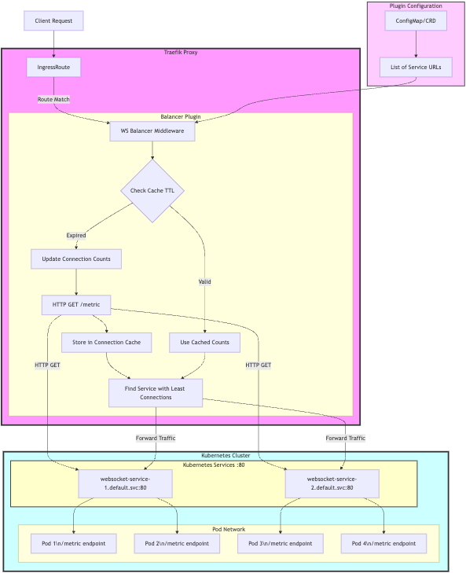

# Traefik WebSocket Connection Balancer

A high-performance WebSocket connection balancer middleware for Traefik that distributes WebSocket connections across multiple backend pods based on their active connection count. This plugin is designed to ensure optimal load distribution for WebSocket-heavy applications.

## Features

- **Intelligent Load Balancing**
  - Distributes connections based on real-time connection counts
  - Automatic selection of least-loaded backend
  - Connection count caching with configurable TTL
  - Graceful failover on backend failures

- **WebSocket Support**
  - Full WebSocket protocol support (RFC 6455)
  - Bidirectional message relay
  - Transparent protocol upgrade handling
  - Support for WebSocket extensions and subprotocols

- **Advanced Configuration**
  - Configurable metrics endpoint for both backend services and the balancer
  - Adjustable timeouts (dial, read, write)
  - TLS/SSL verification options
  - Custom header forwarding

- **Pod-Level Monitoring**
  - Detailed metrics for individual pods
  - Visualization of connection distribution across pods
  - Enhanced debugging capabilities with pod identification

- **Monitoring & Debugging**
  - Detailed logging of connection events
  - Connection metrics exposure through dedicated endpoint
  - Error tracking and reporting
  - Debug-friendly log messages

## Quick Start

### Prerequisites
- Go 1.22 or higher
- gorilla/websocket v1.5.3 or higher

### Installation

1. Clone the repository:
```bash
git clone https://github.com/yourusername/traefikwsbalancer.git
cd traefikwsbalancer
```

2. Install dependencies:
```bash
go mod tidy
```

3. Build the project:
```bash
go build ./...
```

### Basic Usage

1. Start the test server (provides backend WebSocket endpoints):
```bash
go run cmd/test-server/main.go
```

2. In a separate terminal, run the test client:
```bash
go run cmd/test-client/main.go
```

## Configuration

### Core Components

The balancer consists of three main components:
1. WebSocket Balancer (main middleware)
2. Connection Fetcher (metrics collector)
3. WebSocket Relay (message forwarder)

### Configuration Options

```go
type Config struct {
    MetricPath         string        // Path to fetch connection metrics from backends
    BalancerMetricPath string        // Path to expose balancer's metrics
    Services           []string      // List of backend pod URLs
    TLSVerify          bool          // Enable/disable TLS verification
    CacheTTL           int           // Metrics cache duration in seconds
}
```

### Default Values
- MetricPath: "/metric"
- BalancerMetricPath: "/balancer-metrics"
- TLSVerify: true
- CacheTTL: 30 seconds
- DialTimeout: 10 seconds (internal)
- WriteTimeout: 10 seconds (internal)
- ReadTimeout: 30 seconds (internal)

## Backend Implementation

### Implementing the Metrics Endpoint

Each backend service must implement a `/metric` endpoint (or custom path configured in `metricPath`) that returns connection information. For pod-level metrics, the endpoint should include pod identification details.

#### Example in Node.js/Express:

```javascript
app.get("/metric", (req, res) => {
  res.json({
    agentsConnections: activeConnections.size,  // Number of active connections
    podName: process.env.POD_NAME,              // Pod name from Kubernetes
    podIP: process.env.POD_IP,                  // Pod IP from Kubernetes
    nodeName: process.env.NODE_NAME             // Node name from Kubernetes
  });
});
```

#### Example in TypeScript/Express:

```typescript
app.get("/metric", (_req: Request, res: Response) => {
  res.json({
    agentsConnections: agentsConnections.size,  // Number of active connections
    podName: process.env.POD_NAME,              // Pod name from Kubernetes
    podIP: process.env.POD_IP,                  // Pod IP from Kubernetes
    nodeName: process.env.NODE_NAME             // Node name from Kubernetes
  });
});
```

#### Example in Go:

```go
http.HandleFunc("/metric", func(w http.ResponseWriter, r *http.Request) {
    metrics := struct {
        AgentsConnections int    `json:"agentsConnections"`
        PodName           string `json:"podName,omitempty"`
        PodIP             string `json:"podIP,omitempty"`
        NodeName          string `json:"nodeName,omitempty"`
    }{
        AgentsConnections: activeConnections.Count(),
        PodName:           os.Getenv("POD_NAME"),
        PodIP:             os.Getenv("POD_IP"),
        NodeName:          os.Getenv("NODE_NAME"),
    }
    
    w.Header().Set("Content-Type", "application/json")
    json.NewEncoder(w).Encode(metrics)
})
```

### Connection Tracking

Your backend service should track active WebSocket connections. Here's a simple implementation in Node.js:

```javascript
// Track active connections
const activeConnections = new Set();

// WebSocket server setup
const wss = new WebSocketServer({ server });

wss.on('connection', (ws) => {
  // Add connection to tracking
  activeConnections.add(ws);
  
  ws.on('close', () => {
    // Remove connection from tracking
    activeConnections.delete(ws);
  });
});
```

## Metrics Endpoint

The plugin provides a dedicated metrics endpoint that displays:
- Current timestamp
- List of services with their connection counts
- Pod-level metrics showing connection counts per pod
- Total connection count across all services

### Example Metrics Response

```json
{
  "timestamp": "2025-04-06T20:02:59Z",
  "services": [
    {
      "url": "http://service-1.namespace.svc.cluster.local:80",
      "connections": 42
    }
  ],
  "podMetrics": {
    "http://service-1.namespace.svc.cluster.local:80": [
      {
        "agentsConnections": 42,
        "podName": "service-1-pod-abc123",
        "podIP": "10.0.0.1",
        "nodeName": "node-1"
      }
    ]
  },
  "totalConnections": 42,
  "agentsConnections": 42
}
```

## Architecture

### Connection Flow
1. Client initiates WebSocket connection
2. Balancer checks connection counts from all backends
3. Selects backend with lowest connection count
4. Establishes connection to chosen backend
5. Sets up bidirectional relay
6. Monitors connection health

### Load Balancing Algorithm
- Maintains cache of connection counts
- Updates counts based on CacheTTL
- Uses atomic operations for thread safety
- Handles backend failures gracefully

## Production Deployment

### Best Practices
1. **Security**
   - Enable TLS verification in production
   - Implement proper origin checking
   - Set appropriate timeouts

2. **Performance**
   - Adjust CacheTTL based on load
   - Monitor connection counts
   - Set appropriate buffer sizes

3. **Monitoring**
   - Use the dedicated metrics endpoint to monitor traffic distribution
   - Track pod-level metrics to identify potential hotspots
   - Monitor backend health

### Example Configuration with Traefik

```yaml
# Static configuration in the Traefik config file
experimental:
  plugins:
    traefikwsbalancer:
      moduleName: "github.com/K8Trust/traefikwsbalancer"
      version: "v1.0.26"

# Dynamic configuration (Kubernetes CRD)
apiVersion: traefik.io/v1alpha1
kind: Middleware
metadata:
  name: socket-balancer
  namespace: default
spec:
  plugin:
    traefikwsbalancer:
      metricPath: "/metric"
      balancerMetricPath: "/balancer-metrics"
      services:
        - "http://service-1.namespace.svc.cluster.local:80"
      cacheTTL: 30
```

### Kubernetes Configuration

For pod-level metrics to work, ensure your pods expose their identities via environment variables in your deployment:

```yaml
apiVersion: apps/v1
kind: Deployment
metadata:
  name: websocket-service
spec:
  template:
    spec:
      containers:
        - name: websocket-service
          env:
            - name: POD_NAME
              valueFrom:
                fieldRef:
                  fieldPath: metadata.name
            - name: POD_IP
              valueFrom:
                fieldRef:
                  fieldPath: status.podIP
            - name: NODE_NAME
              valueFrom:
                fieldRef:
                  fieldPath: spec.nodeName
```

## Troubleshooting

### Common Issues

1. **Connection Failures**
   - Check backend availability
   - Verify network connectivity
   - Check TLS configuration

2. **Performance Issues**
   - Monitor connection counts via the metrics endpoint
   - Adjust cache TTL
   - Check backend resources

3. **Protocol Errors**
   - Verify WebSocket upgrade headers
   - Check protocol compatibility
   - Monitor message sizes

4. **Missing Pod Metrics**
   - Ensure pod environment variables are correctly set
   - Verify backend metric endpoint returns pod information
   - Check plugin logs for decoding errors

5. **Endpoint Implementation Issues**
   - Verify your backend's `/metric` endpoint returns valid JSON
   - Check for proper formatting of the `agentsConnections` field
   - Ensure connection tracking is accurately maintained

### Debugging

Enable detailed logging:
```go
log.SetFlags(log.Lshortfile | log.Ltime | log.Lmicroseconds)
```

## Contributing

1. Fork the repository
2. Create your feature branch
3. Commit your changes
4. Push to the branch
5. Create a Pull Request



## License

MIT License

## Support

For issues and feature requests, please create an issue in the GitHub repository.

## Acknowledgments

- gorilla/websocket team for the excellent WebSocket implementation
- Traefik team for the plugin system
- Contributors who have helped improve this project